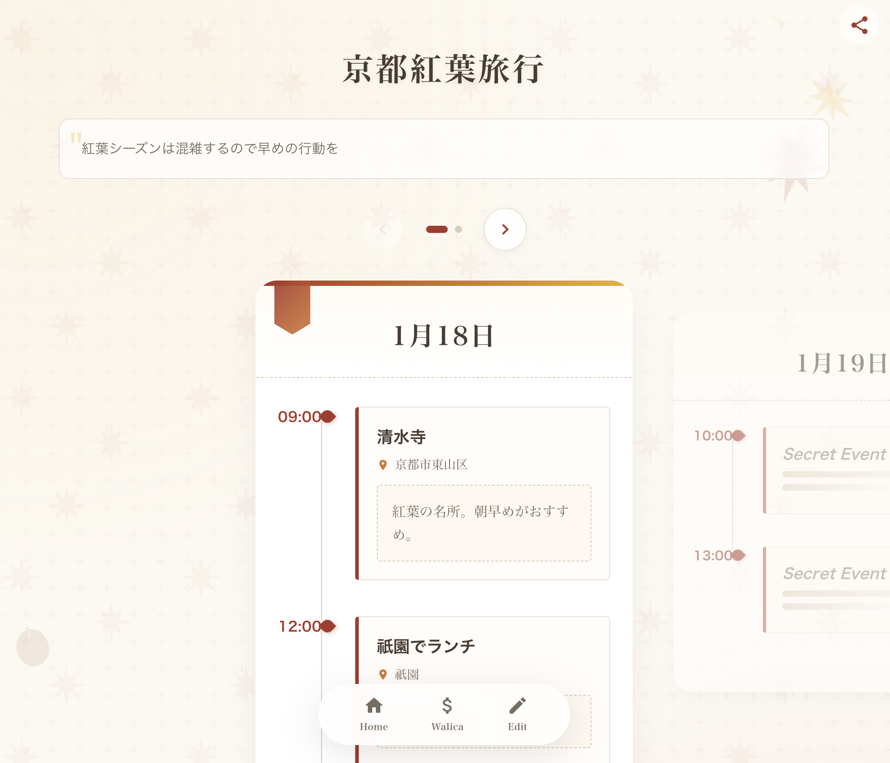
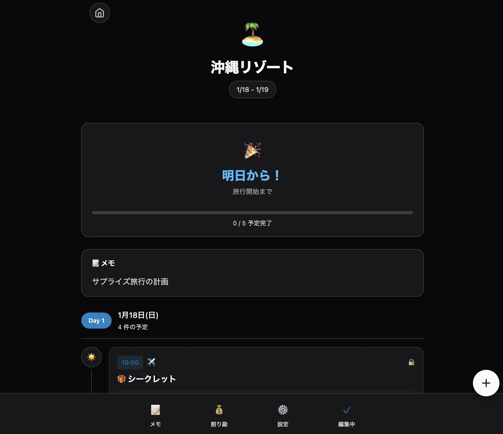
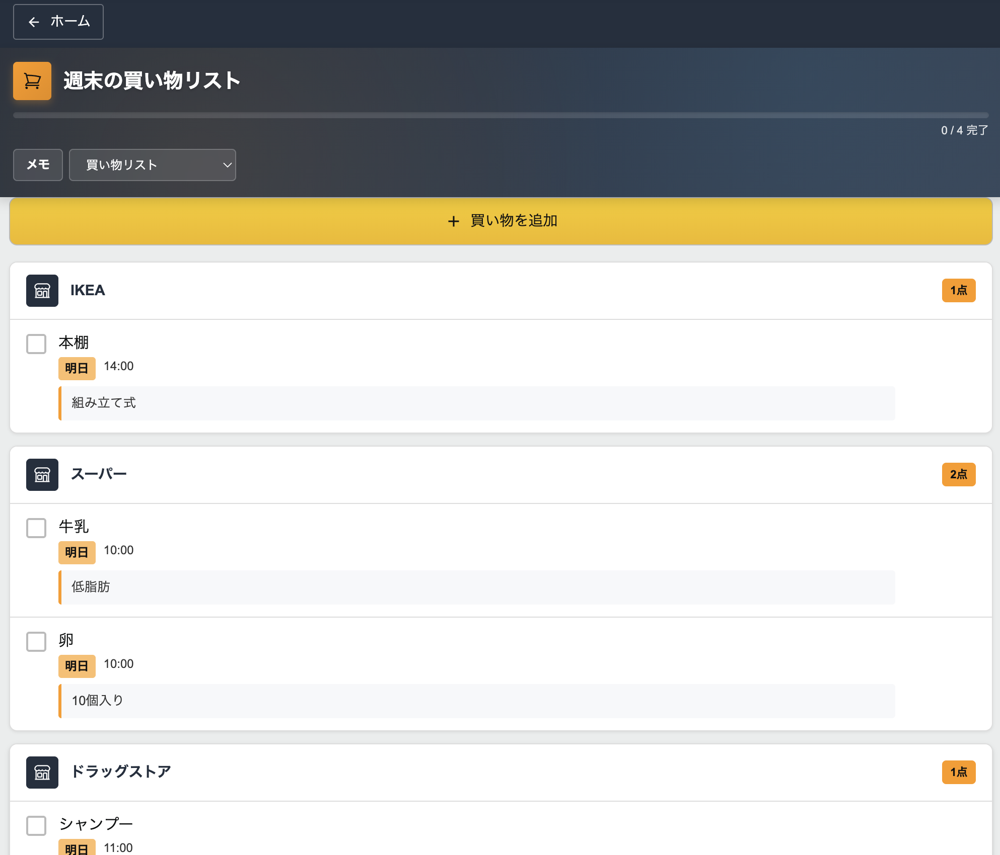
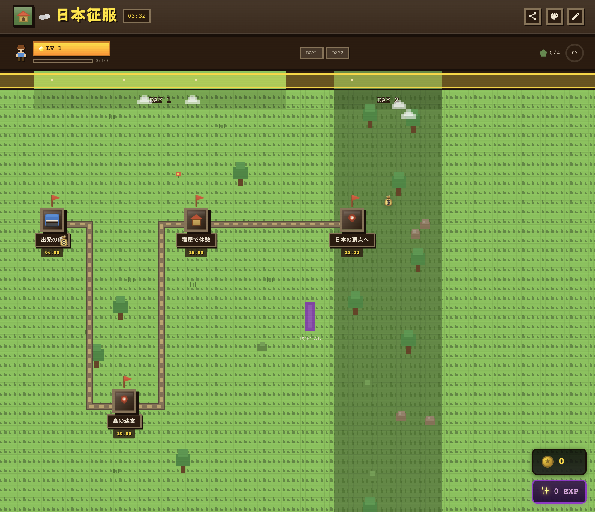
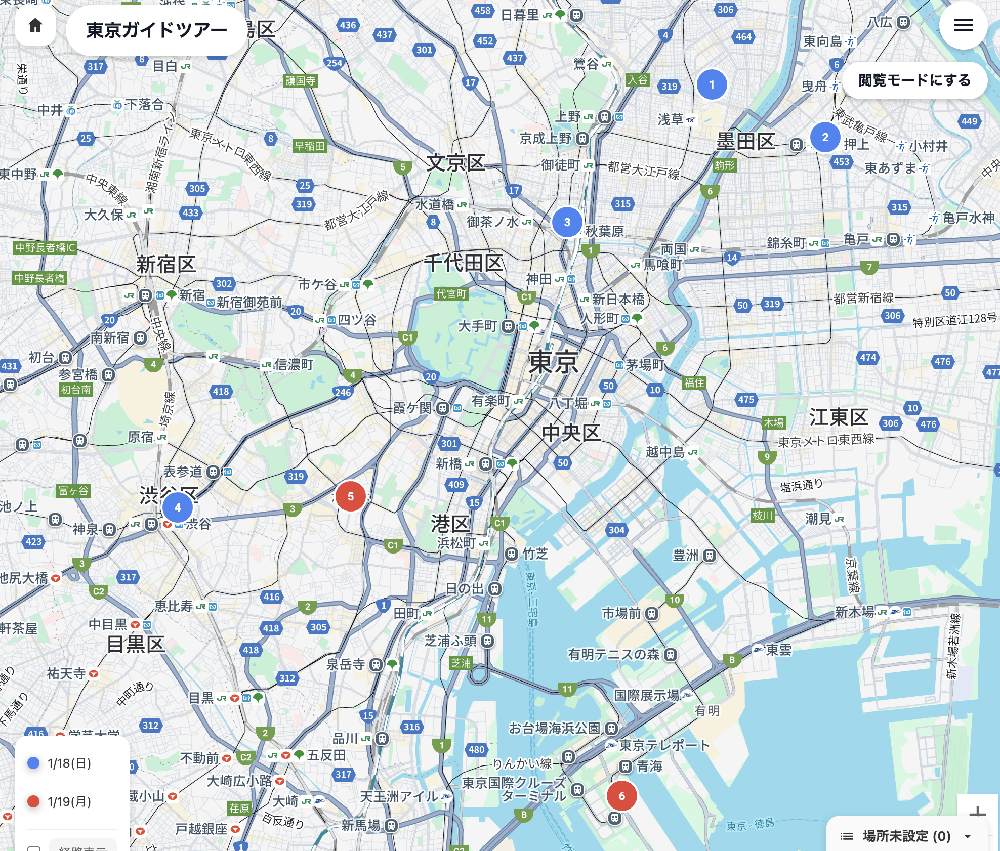
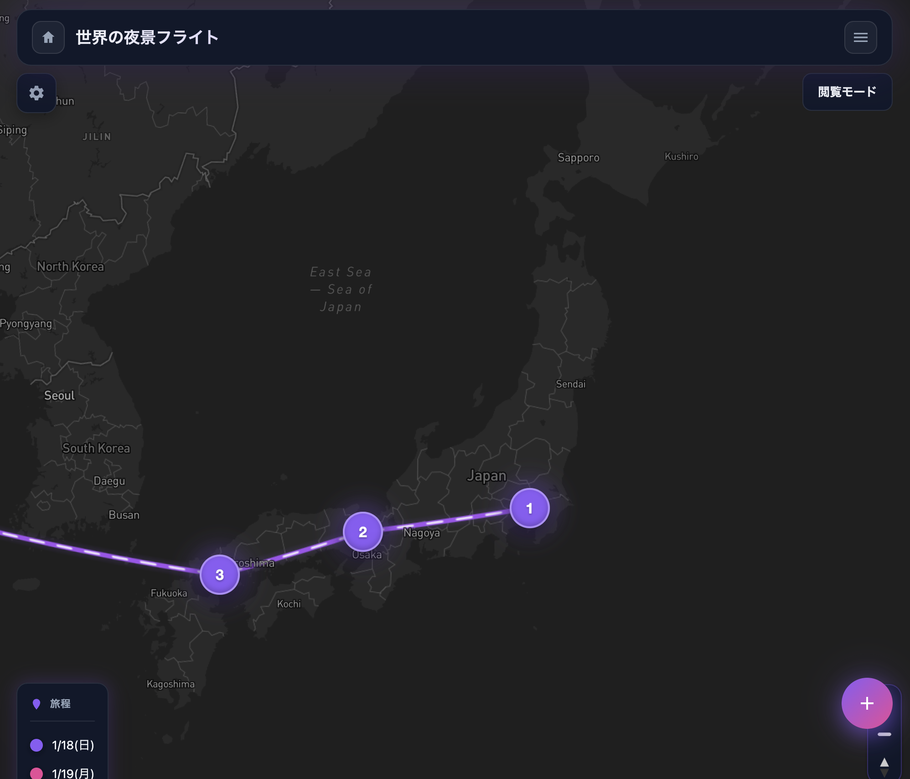

# たびたび

たびたびは、旅のしおりを作成・共有できる多機能Webアプリケーションです。

実際に使ってみる https://tabitabi.pages.dev

## 主な機能

### 1. しおりの作成

旅行の予定を日程ごとに整理し、場所や時間、メモを記録できます。
編集パスワードを設定することも可能です。

### 2. テーマの変更

見た目や使える機能がテーマごとに異なります。用途に応じて最適なテーマを選択できます。

テーマは随時作成中で、デザインテーマのみをhtml,css,jsのみで作成することも可能なため、デザインアイデアなども募集中です！

 

 

 
