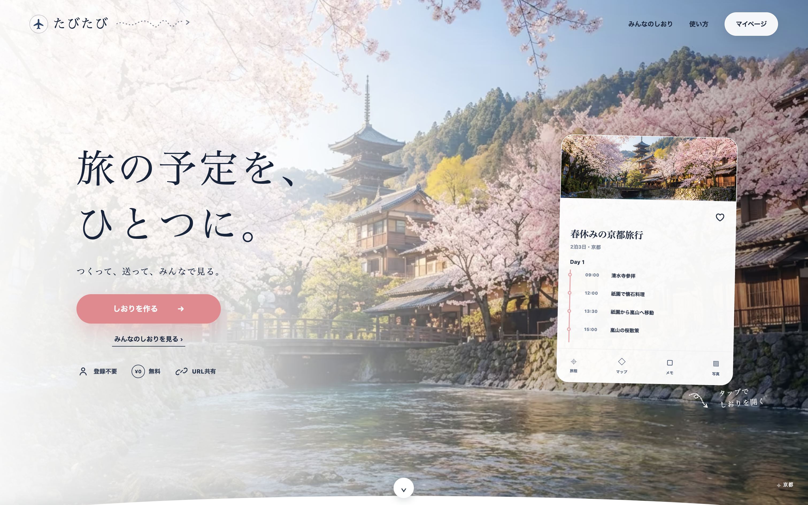
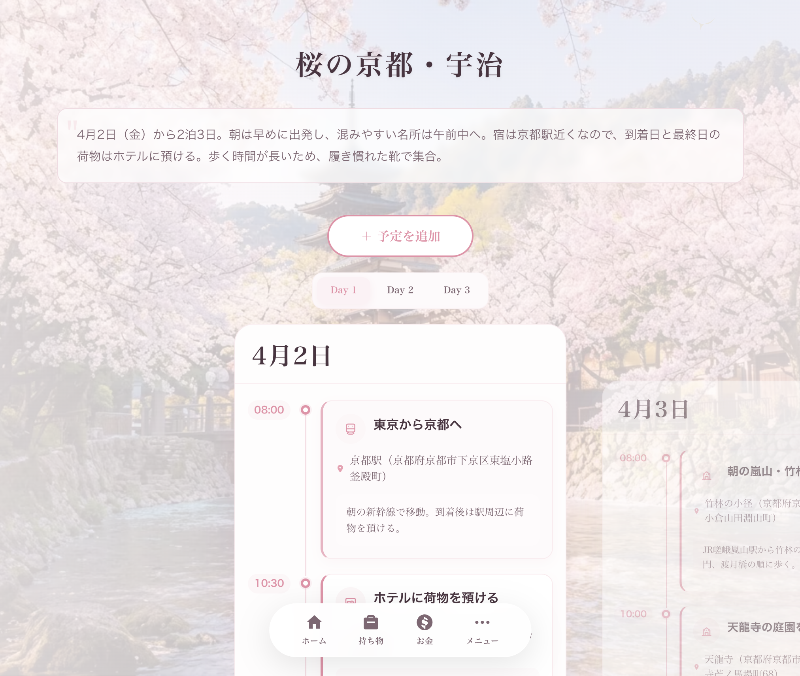
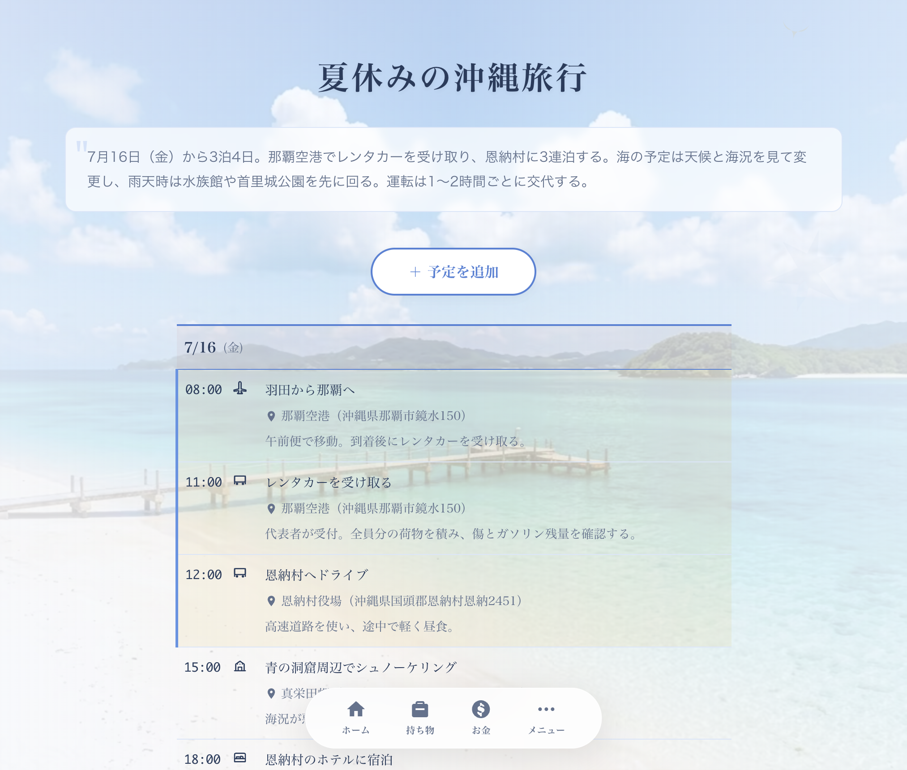
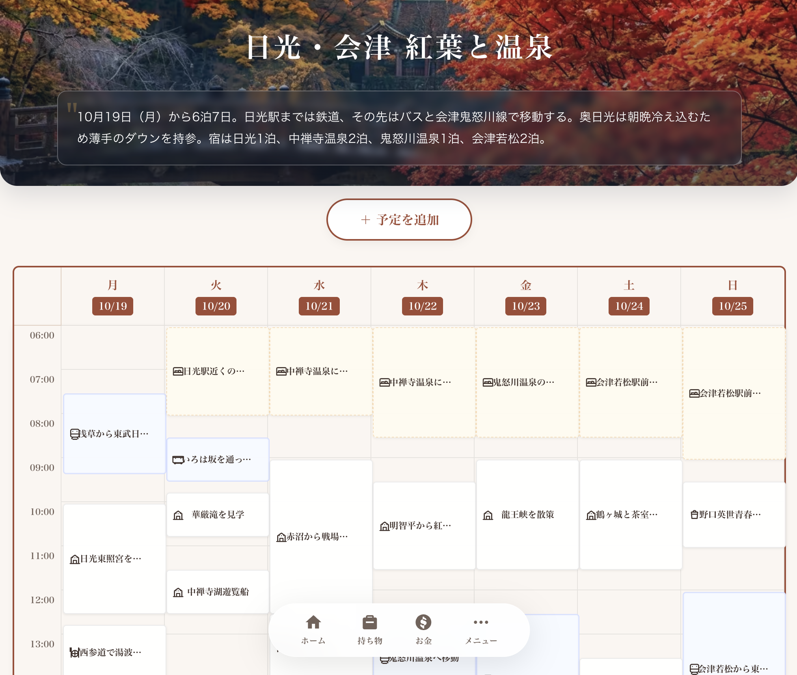
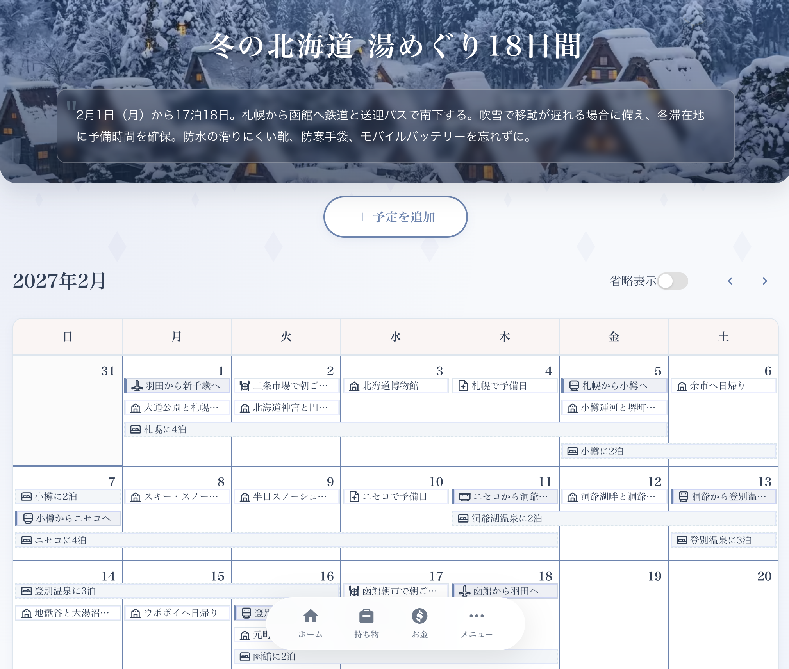
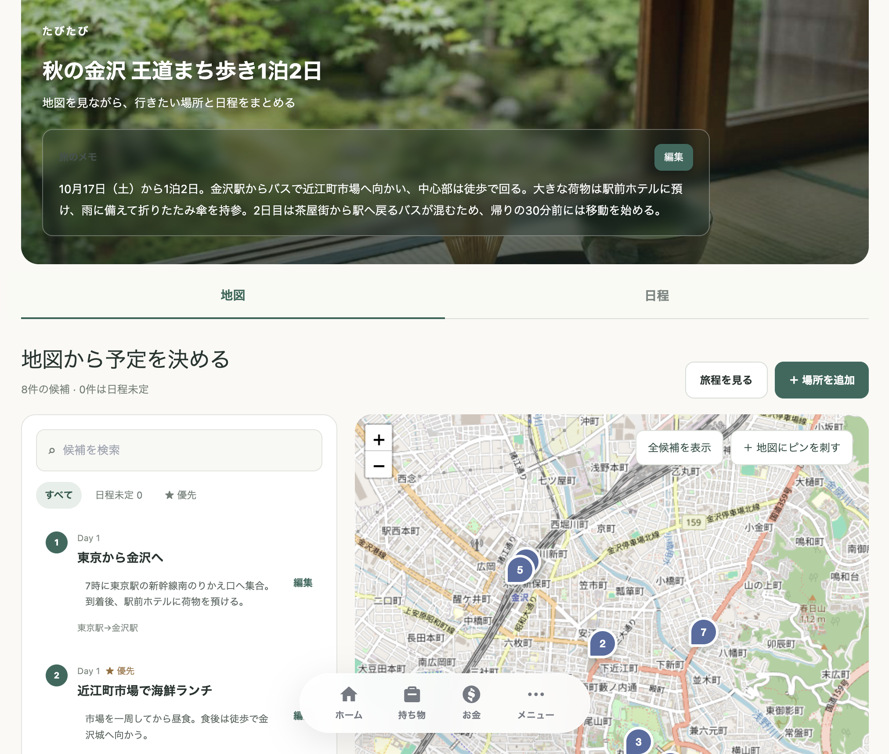
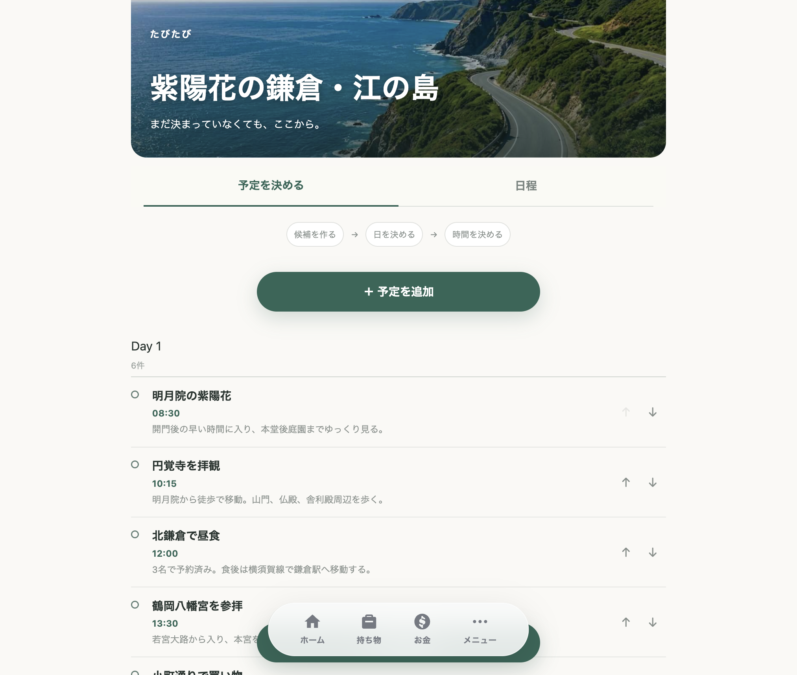

# [たびたび](https://tabitabi.pages.dev)

たびたびは、旅のしおりを作成・共有できる多機能Webアプリケーションです。

実際に使ってみる https://tabitabi.pages.dev

## 主な機能

### 1. しおりの作成

旅行の予定を日程ごとに整理し、場所や時間、メモを記録できます。
編集パスワードを設定することも可能です。

### 2. 様々な機能

テーマによって見た目を変えたり、旅行にあると助かる機能を搭載しています。

 

<a href="https://tabitabi.pages.dev/itineraries/official-autumn-public"> 

