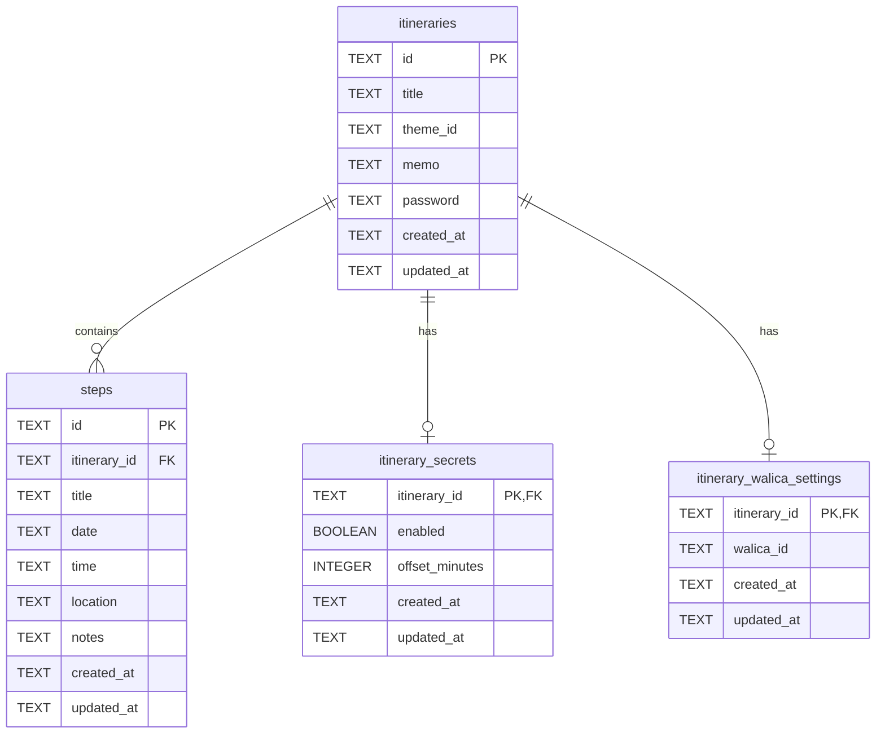

# Database Schema

## ER Diagram

```mermaid
erDiagram
    itineraries ||--o{ steps : contains
    itineraries ||--o| itinerary_secrets : has
    itineraries ||--o| itinerary_walica_settings : has

    itineraries {
        TEXT id PK
        TEXT title
        TEXT theme_id
        TEXT memo
        TEXT password
        TEXT created_at
        TEXT updated_at
    }

    itinerary_secrets {
        TEXT itinerary_id PK, FK
        BOOLEAN enabled
        INTEGER offset_minutes
        TEXT created_at
        TEXT updated_at
    }

    itinerary_walica_settings {
        TEXT itinerary_id PK, FK
        TEXT walica_id
        TEXT created_at
        TEXT updated_at
    }

    steps {
        TEXT id PK
        TEXT itinerary_id FK
        TEXT title
        TEXT date
        TEXT time
        TEXT location
        TEXT notes
        TEXT created_at
        TEXT updated_at
    }
```
