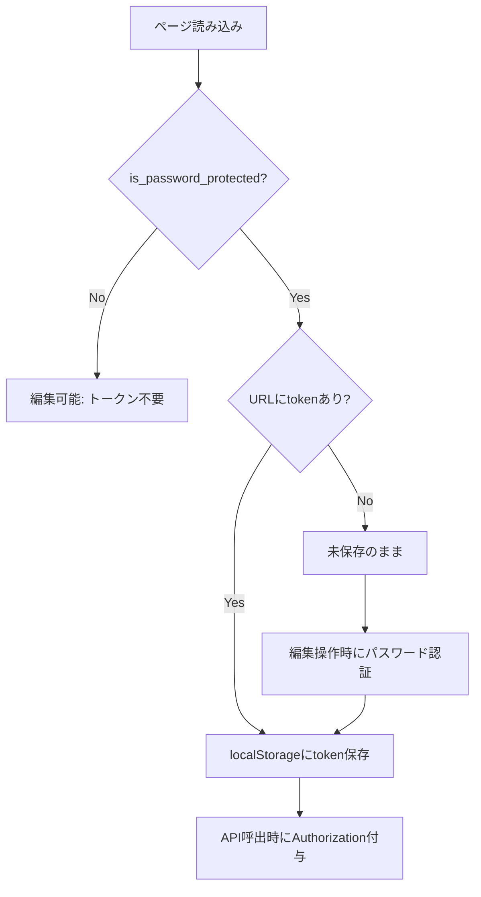

# アーキテクチャ

「たびたび」のプロジェクト構造と技術スタックについて説明します。

## 技術スタック

### フロントエンド
- **フレームワーク**: SvelteKit 2.x
- **言語**: TypeScript
- **スタイリング**: Tailwind CSS
- **ビルドツール**: Vite

### バックエンド
- **ランタイム**: Cloudflare Workers
- **データベース**: Cloudflare D1 (SQLite)
- **ORM**: なし（生SQL）

### デプロイ
- **ホスティング**: Cloudflare Pages
- **CI/CD**: GitHub Actions（予定）

## プロジェクト構造

```
tabitabi/
├── apps/
│   ├── api/                 # バックエンドAPI
│   │   ├── src/
│   │   │   ├── index.ts     # エントリーポイント
│   │   │   ├── routes/      # APIルート
│   │   │   └── services/    # ビジネスロジック
│   │   └── wrangler.toml    # Cloudflare Workers設定
│   │
│   └── web/                 # フロントエンド
│       ├── src/
│       │   ├── routes/      # ページコンポーネント
│       │   │   ├── home/    # ホーム画面
│       │   │   └── [id]/    # しおり表示（動的ルート）
│       │   └── lib/
│       │       ├── themes/  # テーマ定義
│       │       └── components/ # 共有コンポーネント
│       ├── static/          # 静的アセット
│       └── scripts/         # ビルドスクリプト
│
├── packages/
│   └── types/               # 共有型定義
│
├── migrations/              # DBマイグレーション
│
└── docs/                    # ドキュメント
```

## データフロー

### しおり作成フロー

```
1. ユーザー入力（Web）
   ↓
2. APIリクエスト（/api/itineraries POST）
   ↓
3. D1データベースに保存
   ↓
4. レスポンス（しおりID）
   ↓
5. しおりページへリダイレクト
```

### しおり表示フロー

```
1. URLアクセス（/[id]）
   ↓
2. APIリクエスト（/api/itineraries/[id] GET）
   ↓
3. D1データベースから取得
   ↓
4. テーマに応じたコンポーネントで描画
```

## 設計思想

### 1. シンプルさ優先

- アカウント管理なし
- 最小限のAPI
- 直感的なUI

### 2. テーマ指向

- テーマは独立したコンポーネント
- 各テーマは`src/lib/themes/`に配置
- テーマ切り替えは動的ロード

### 3. プラグイン的機能追加

- 基本テーブル（`itineraries`）はシンプルに保つ
- 新機能は別テーブルで管理
- 例: `itinerary_walica_settings`, `itinerary_steps_secret`

### 4. PWA対応

- Service Worker
- マニフェストファイル
- オフライン対応（閲覧のみ）

## データベース設計

主要テーブル:

### `itineraries`
しおりの基本情報

| カラム | 型 | 説明 |
|--------|---------|------|
| id | TEXT PRIMARY KEY | UUID |
| title | TEXT | タイトル |
| theme_id | TEXT | テーマID |
| memo | TEXT | メモ |
| password | TEXT | 編集パスワード |
| created_at | TEXT | 作成日時 |
| updated_at | TEXT | 更新日時 |

### `itinerary_steps`
予定・ステップ

| カラム | 型 | 説明 |
|--------|---------|------|
| id | TEXT PRIMARY KEY | UUID |
| itinerary_id | TEXT | しおりID（外部キー） |
| day | INTEGER | 日目 |
| time | TEXT | 時刻 |
| location | TEXT | 場所 |
| description | TEXT | 説明 |
| order | INTEGER | 表示順 |

詳細は[データベース](database.md)をご覧ください。

## テーマシステム

### テーマの構造

各テーマは`src/lib/themes/[theme-id]/`に配置:

```
themes/standard-autumn/
├── index.svelte           # メインコンポーネント
├── components/            # テーマ固有コンポーネント
├── styles.css             # スタイル
└── types.ts               # 型定義
```

### テーマの登録

`src/lib/themes/index.ts`でテーマを登録:

```typescript
export const themes = {
  'minimal': {
    name: 'Minimal',
    load: () => import('./minimal/index.svelte')
  },
  // ...
}
```

詳細は[テーマ開発](theme-development.md)をご覧ください。

## API設計

RESTful API:

- `POST /api/itineraries` - しおり作成
- `GET /api/itineraries/:id` - しおり取得
- `PUT /api/itineraries/:id` - しおり更新
- `DELETE /api/itineraries/:id` - しおり削除

認証:
- 編集操作にはパスワードが必要
- パスワードは`Authorization: Bearer [password]`ヘッダーで送信
- サーバー側でハッシュ値と比較

## パフォーマンス最適化

### コード分割
- テーマは動的インポート
- ページごとの分割

### キャッシング
- 静的アセットのCDNキャッシュ
- Service Workerでのキャッシング

### 軽量化
- 依存ライブラリの最小化
- Tree shakingの活用

## セキュリティ

### パスワード保護とトークン運用
- パスワードは平文で保存（将来ハッシュ化予定）
- JWTトークンは「編集権限が必要な（パスワード設定あり）しおり」のみで使用
- パスワード未設定のしおりはトークンを保存せず、`Authorization` ヘッダーも送信しない
- トークンには有効期限あり（30日）

編集権限判定のフロー:



クライアント実装の要点:
- `+page.svelte` で `auth.setPasswordProtected(id, is_password_protected)` を記録
- `client.getAuthHeaders()` は `is_password_protected=true` のときのみ `Authorization` を付与
- 各テーマは `token` の保存を `is_password_protected` でガード

### XSS対策
- Svelteの自動エスケープ
- Content Security Policy

### CSRF対策
- 現在未実装（今後検討）

## 今後の展望

- [ ] テストカバレッジの向上
- [ ] CI/CDパイプライン
- [ ] エクスポート機能
- [ ] パフォーマンスモニタリング
- [ ] エラートラッキング

## 参考リンク

- [SvelteKit ドキュメント](https://kit.svelte.dev/)
- [Cloudflare Workers ドキュメント](https://developers.cloudflare.com/workers/)
- [Cloudflare D1 ドキュメント](https://developers.cloudflare.com/d1/)
