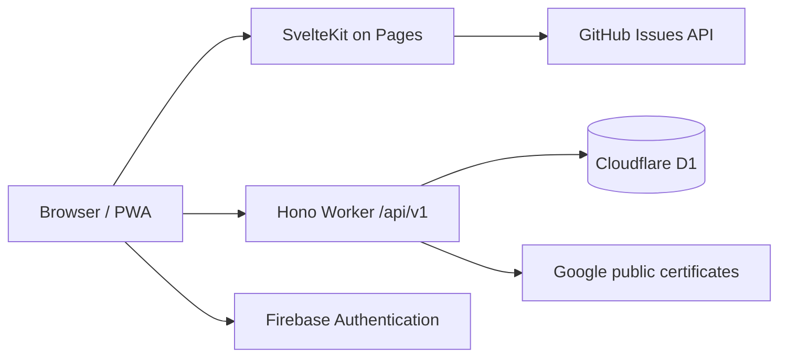
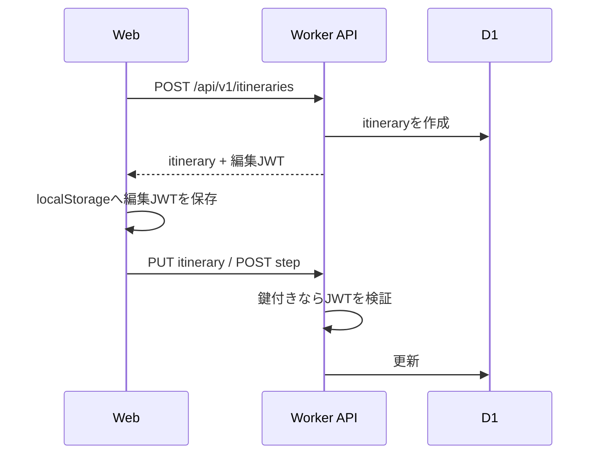

# アーキテクチャ

「たびたび」は、SvelteKitのWebアプリ、Honoで構築したCloudflare Worker API、
Cloudflare D1、共有TypeScript型からなるpnpm monorepoです。

## 技術スタック

| レイヤー | 主な技術 |
|---|---|
| Web | Svelte 5、SvelteKit 2、TypeScript、Vite、Tailwind CSS |
| API | Cloudflare Workers、Hono、Zod |
| Database | Cloudflare D1（SQLite）、生SQL |
| アカウント認証 | Firebase Authentication、`jose` によるIDトークン検証 |
| しおり編集認証 | bcryptjs、署名付きJWT（有効期間30日） |
| Unit / integration test | Vitest、Cloudflare Workers pool、Testing Library |
| E2E | Playwright |
| Build / workspace | pnpm workspace、Turborepo |
| Deploy | Cloudflare Pages、Cloudflare Workers、GitHub Actions |

## プロジェクト構造

```text
tabitabi/
├── apps/
│   ├── api/
│   │   ├── migrations/       # D1マイグレーション（スキーマの正本）
│   │   ├── src/
│   │   │   ├── middleware/   # CORS、しおりJWT、Firebase認証
│   │   │   ├── routes/       # HonoのAPIルート
│   │   │   ├── services/     # DBアクセスとドメイン処理
│   │   │   ├── utils/        # JWT、Firebase、公開用変換など
│   │   │   └── validators/   # Zod入力検証
│   │   └── test/             # Worker統合テスト
│   └── web/
│       ├── scripts/          # docs生成、ビルド後処理、環境変数チェック
│       ├── src/
│       │   ├── lib/
│       │   │   ├── api/      # ブラウザ側APIクライアント
│       │   │   ├── auth/     # しおり編集トークン
│       │   │   ├── demo/     # APIを使わないデモ状態
│       │   │   ├── print/    # テーマ非依存の印刷データ／画面
│       │   │   └── themes/   # テーマとテーマカタログ
│       │   ├── routes/       # SvelteKitページとサーバールート
│       │   └── service-worker.ts
│       └── tests/e2e/        # Playwright
├── packages/types/           # WebとAPIで共有する型・定数
├── docs/                     # Markdownドキュメント
├── .github/workflows/        # CI、本番、PR Preview、cleanup
├── Makefile
└── turbo.json
```

生成したドキュメントは `apps/web/static/docs/` に置かれます。このディレクトリを直接
編集せず、`docs/` のMarkdownを更新して `pnpm --filter web build:docs` を実行します。

## 実行時の構成


```mermaid
flowchart LR
    Browser[Browser / PWA] --> Web[SvelteKit on Pages]
    Browser --> API[Hono Worker /api/v1]
    API --> D1[(Cloudflare D1)]
    Browser --> Firebase[Firebase Authentication]
    API --> FirebaseCerts[Google public certificates]
    Web --> GitHub[GitHub Issues API]
```

- Webはしおりページ `/:id` を読み込み、APIからしおりと予定を取得してテーマを動的ロードします。
- APIレスポンスは原則 `{ success: true, data }`、失敗時は `{ success: false, error }` です。
- 要望フォームはSvelteKitのサーバールート `/api/feedback` からGitHub Issueを作成します。
- 地図用トークンもSvelteKitのサーバールートを経由し、秘密値をブラウザへ直接埋め込みません。

## 主要フロー

### しおりの作成と編集


```mermaid
sequenceDiagram
    participant W as Web
    participant A as Worker API
    participant D as D1
    W->>A: POST /api/v1/itineraries
    A->>D: itineraryを作成
    A-->>W: itinerary + 編集JWT
    W->>W: localStorageへ編集JWTを保存
    W->>A: PUT itinerary / POST step
    A->>A: 鍵付きならJWTを検証
    A->>D: 更新
```

パスワードなしの通常しおりは、URLを知っている人が編集できます。パスワード付きの
しおりはbcryptハッシュをD1へ保存し、パスワード確認後にそのしおり専用JWTを発行します。

### アカウント

Firebaseがメールアドレスとアカウントパスワードを管理し、D1の `users` はFirebase UID、
ユーザー名、都道府県、メール確認状態を保持します。Workerは秘密鍵を持たず、Googleの
公開証明書でFirebase IDトークンの署名、issuer、audience、期限、メール確認状態を検証します。

アカウントは、しおりの基本作成・編集には必須ではありません。次の機能で使用します。

- 作成済みしおりをマイページへ保存・同期する
- 公開プロフィールと「みんなのしおり」へ公開する
- 閲覧専用の公開スナップショットを自分用にコピーする

### 共有と公開スナップショット

共有には3種類あります。

1. 元しおりのURL: トークンを含まない。鍵付きなら閲覧のみ、鍵なしなら編集も可能
2. 編集用URL: しおりJWTをクエリに含み、受け取った人へ編集権限を渡す
3. 公開用URL: `source_itinerary_id` を持つ閲覧専用スナップショット

公開用スナップショットは、メモと予定内のメールアドレス、電話番号、予約番号、部屋番号を
規則ベースで伏せ、シークレット設定、Walica、お金、持ち物をコピーしません。元しおりとは
別レコードなので、変更後は再公開が必要です。

### テーマのロード

`apps/web/src/lib/themes/catalog.ts` が選択肢とWeb側の既定テーマを管理し、
`apps/web/src/lib/themes/index.ts` の `loadTheme()` がテーマごとに動的importします。
標準の春・夏・秋・冬は `standard-seasons/shared/` の機能実装を共有し、色やデモデータだけを
季節別ディレクトリで差し替えます。

### PWAとキャッシュ

Service Workerはビルド成果物と静的ファイルをcache-firstで配信します。画面遷移とGETデータは
network-firstで、成功したレスポンスをキャッシュします。未訪問データの完全なオフライン利用や、
オフライン中の更新キューは提供していません。

## API構成

ベースパスは `/api/v1` です。

| グループ | 主な用途 |
|---|---|
| `/auth` | しおり編集JWTの発行・検証 |
| `/itineraries` | CRUD、公開スナップショット、コピー |
| `/steps` | 予定のCRUD、シークレット表示制御 |
| `/users` | アカウント初期化、プロフィール、保存・公開、検索 |
| `/itineraries/:id/members` | 旅行メンバー |
| `/itineraries/:id/money` | 予算、支出、精算 |
| `/itineraries/:id/packing` | グループ、持ち物、チェック状態 |

APIルートは `apps/api/src/index.ts` で明示的にmountします。ファイルを追加しただけでは公開されません。
`timeline.ts` と `timeline.service.ts` は現在indexからmountされていない旧実装です。

> [!WARNING]
> `GET /api/v1/itineraries` は現在、認証なしで元しおりと公開スナップショットを含む全件を返し、
> Webの `/itineraries` もその一覧を表示します。`user_bookmarks.is_visible = 0` は公開プロフィールと
> 「みんなのしおり」へ載せない設定であり、しおり自体を非公開にするアクセス制御ではありません。

## データ所有と権限

現在の権限モデルでは、Firebaseアカウントとしおり編集権限は別物です。

| 対象 | 認証情報 | 判定 |
|---|---|---|
| 鍵なししおりの編集 | なし | 公開スナップショットでなければ可 |
| 鍵付きしおりの編集 | しおりJWT | JWTの `shioriId` が対象IDと一致 |
| マイページ・公開設定 | Firebase ID token | メール確認済みかつプロフィール設定済み |
| 公開しおりのコピー | Firebase ID token | ログイン・プロフィール設定が必須 |

アカウントに保存されたことだけでは、しおりの編集権限にはなりません。逆に、編集用URLを
持っていても、そのしおりが自動的に特定アカウントの所有物になるわけではありません。

## セキュリティ上の要点

- しおりパスワードはbcryptでハッシュ化する
- しおりJWTとFirebase ID tokenは用途を分離する
- Firebase Web設定値は公開識別子、`JWT_SECRET` や外部APIトークンはサーバー側secretとして扱う
- Markdownは許可タグ・属性・URLスキームを限定してサニタイズする
- 公開用変換は補助的な規則ベース処理なので、公開前に利用者自身でも内容を確認する
- 公開スナップショットはAPIでも更新・削除・予定変更を拒否する
- 現行の全件一覧APIを残す間は、通常しおりも非公開データとして扱わない

データベースの詳細は[データベース](database.md)、認証環境の設定は
[Firebaseアカウント認証](account-auth.md)を参照してください。
