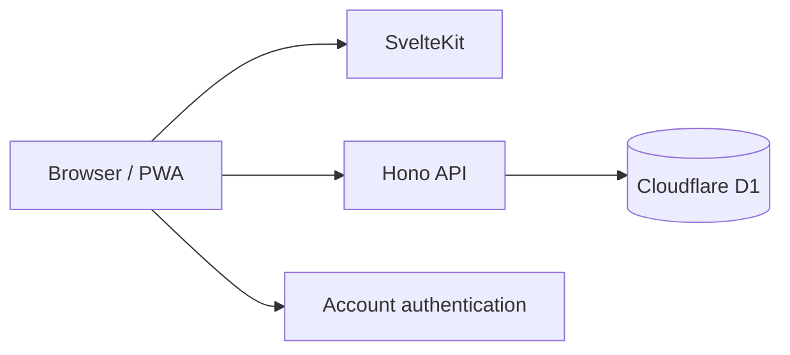

# アーキテクチャ

「たびたび」は、Web、API、データベース、共有型を分離したpnpm monorepoです。利用者はブラウザだけでなくPWAとしてもWebを利用します。

## 構成

| レイヤー | 役割 |
|---|---|
| Web | SvelteKitによる画面、テーマ、PWA、ブラウザ側の状態管理 |
| API | Honoを使ったHTTP API、認証、入力検証、ドメイン処理 |
| Database | Cloudflare D1を使った永続化 |
| Shared types | WebとAPIで共有するTypeScript型・定数 |
| Account auth | Firebase Authenticationを使ったアカウント認証 |
| Tests | VitestとPlaywrightによる自動テスト |

具体的なライブラリバージョンは各`package.json`を正本とします。

## プロジェクト構造

```text
tabitabi/
├── apps/
│   ├── api/              # API Worker
│   ├── db/               # D1 migrationとschema
│   └── web/              # SvelteKit Web / PWA
├── packages/
│   └── types/            # 共有型・定数
├── docs/                 # Markdownドキュメント
└── .github/workflows/    # CIとデプロイ
```

詳細なディレクトリ構造は実装側を正本とし、ドキュメントへ全ファイル構成を複製しません。

## 実行時の流れ


```mermaid
flowchart LR
    Client[Browser / PWA] --> Web[SvelteKit]
    Client --> API[Hono API]
    API --> DB[(Cloudflare D1)]
    Client --> Auth[Account authentication]
```

Webは画面表示と利用者操作を担当し、永続化が必要な処理はAPIを通します。WebとAPIで共有するデータ構造は`packages/types/`で揃えます。

## 認証と権限

アカウント認証と、個別のしおりを編集する権限は別に扱います。

- アカウント認証: 保存一覧、プロフィール、公開などアカウント向け機能
- しおり編集権限: 個別しおりの内容を変更するための権限
- 公開表示: 閲覧を前提にした共有・公開用の表示

APIを追加するときは、どの認証情報が必要か、閲覧と編集の境界はどこかを明確にしてください。

## データ

D1スキーマの正本は`apps/db/migrations/sql/`です。`apps/db/schema.sql`は新規DB向けの生成物として扱います。

ドキュメントでは個別カラムを網羅せず、設計原則と主要な関連だけを説明します。詳細は[データベース](database.md)を参照してください。

## テーマと機能

テーマの選択肢は`apps/web/src/lib/themes/catalog.ts`を正本とします。テーマごとの実装と、テーマに依存しない機能は分離し、共有できるUIやロジックは`apps/web/src/lib/`配下へ置きます。

テーマ一覧や有効・無効の状態は変化しやすいため、ドキュメントへ固定の全一覧を持たせません。

## PWA

`apps/web/static/manifest.webmanifest`と`apps/web/src/service-worker.ts`がPWAの基本構成です。

Service Workerは静的ファイルをキャッシュし、画面遷移やGETリクエストではネットワークを優先しつつ、取得済みレスポンスをキャッシュへ保存します。

PWAは完全なオフライン編集を前提にしません。作成・更新などサーバーへ反映する操作はオンラインを前提とします。

開発時は、通常のブラウザ表示だけでなく次も確認してください。

- standalone表示
- モバイルのsafe area
- Service Worker更新後の表示
- キャッシュが残った状態での互換性
- オフライン時の読み取りフォールバック

## セキュリティ

- 秘密値をクライアントへ埋め込まない
- 入力をAPI境界で検証する
- 認証方式ごとの用途を混在させない
- Markdownや外部URLを安全に扱う
- 公開用の自動変換だけに個人情報保護を依存しない

個別の実装名や一時的な制限ではなく、継続して守るべき境界をドキュメントへ残します。
