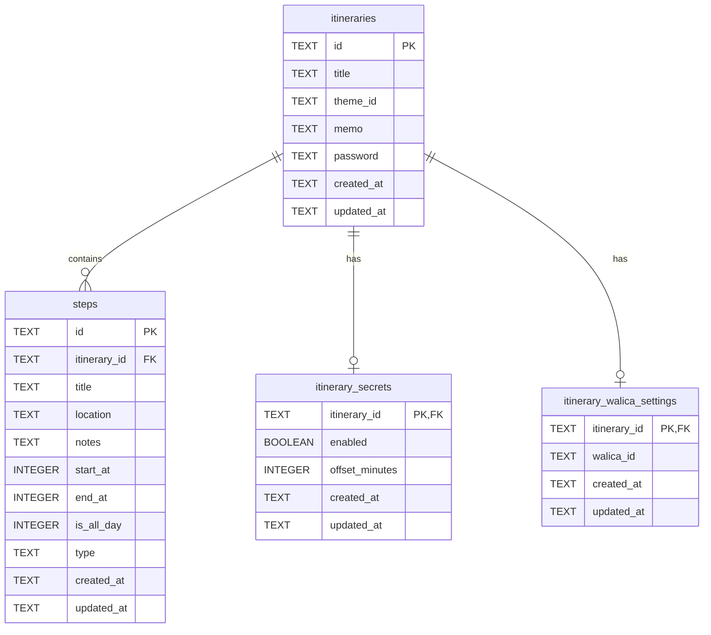

# Database Schema

- itinerariesテーブルはシンプルにする
- 機能追加の場合は別でitinerariesに依存したテーブルを作成する
- そのため、itinerariesテーブルにはカラムを追加することはないと考えられる。

## ER Diagram

## Step Type Format

Step の `type` カラムはカテゴリとタイプを `category:type` 形式で保存します。

### 通常の予定 (normal)
- `normal:general` - 一般的な予定
- `normal:food` - 食事
- `normal:hotel` - 宿泊
- `normal:sightseeing` - 観光

### 移動 (transport)
- `transport:general` - 一般的な移動
- `transport:train` - 電車
- `transport:car` - 車
- `transport:plane` - 飛行機
- `transport:bus` - バス
