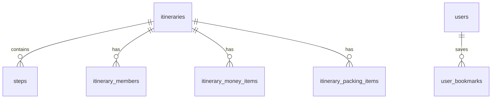

# データベース

「たびたび」はCloudflare D1を利用します。

## 正本

スキーマの正本は`apps/db/migrations/sql/`です。`apps/db/schema.sql`は、新しいDBを作成するときに利用する生成済みスキーマとして扱います。

テーブルやカラムの最新状態を確認するときは、ドキュメントの表ではなくマイグレーションと生成スキーマを確認してください。

## 設計方針

- しおり本体には、しおり全体で必要な情報だけを持たせる
- 独立した機能のデータは従属テーブルへ分離する
- しおりに属するデータは、削除時の扱いを明示する
- 外部キーで、異なるしおりのデータを誤って関連付けない
- Web向けの型変換はAPI境界で行う
- 可変構造をJSONで保存する場合は、読み書きする共有型とhelperを用意する
- 適用済みマイグレーションは編集せず、新しいマイグレーションで変更する

## 主なデータ領域


```mermaid
erDiagram
    itineraries ||--o{ steps : contains
    itineraries ||--o{ itinerary_members : has
    itineraries ||--o{ itinerary_money_items : has
    itineraries ||--o{ itinerary_packing_items : has
    users ||--o{ user_bookmarks : saves
```

実際の関連、制約、トリガー、インデックスは`apps/db/schema.sql`を正本とします。

## しおりと予定

`itineraries`はしおりの基本情報、`steps`は予定を保持します。予定はしおりへ属し、日時や場所、メモ、リンクなどを持ちます。

公開やコピーなどで別のしおりを作る場合は、元データとの関係と、更新・削除時の扱いを明確にしてください。

## アカウントと保存

アカウント認証そのものと、D1に保存するプロフィール・しおりとの関連は分けて扱います。

DB側へ認証方式の移行履歴や互換処理の説明を残すのではなく、現行コードが利用するカラムと制約をスキーマから確認してください。

## メンバー、持ち物、お金

旅行メンバーは、持ち物やお金のデータから参照されます。削除や変更で履歴が壊れないよう、外部キーとAPI側の検証を組み合わせます。

機能追加では次を確認してください。

- しおり削除時にデータをどう扱うか
- 参照中のメンバーや予定を削除できるか
- 別のしおりに属するIDを参照できないか
- 金額や数量などの範囲をどこで検証するか
- 公開・コピーへ含めるか

## マイグレーション

新しい変更は新規マイグレーションとして追加します。

```bash
make migrate-new name=change_name
make migrate-up
```

空のローカルDBへ全マイグレーションを適用できることを確認してください。必要に応じて`apps/db/schema.sql`も生成・検証します。

## ドキュメント方針

このページには、過去に削除されたテーブル、移行のためだけに存在した処理、特定リリース時点の差分は記載しません。

最新のテーブル定義が必要な場合はスキーマ、実際の読み書きが必要な場合はAPIのroute・service・testを参照してください。
