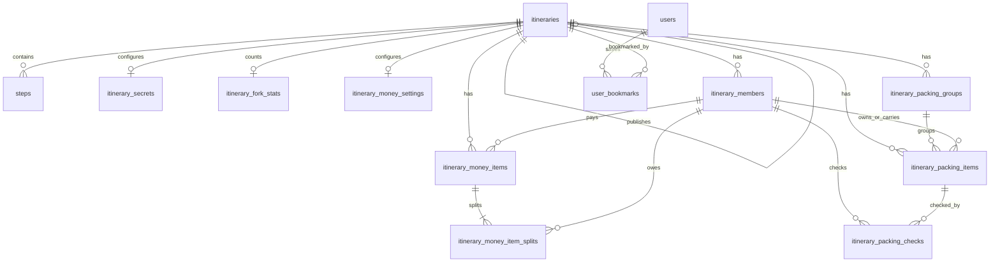

# データベース

「たびたび」は Cloudflare D1（SQLite）を使用します。スキーマの正本は
`apps/api/migrations/*.sql` です。このページは `0024_normalize_itinerary_relations.sql`
までを反映しています。

## 設計方針

- `itineraries` には、しおり全体に必須の情報だけを置く
- シークレット、公開統計、お金、持ち物などの機能は従属テーブルへ分離する
- しおりに属するデータは、原則として `ON DELETE CASCADE` で削除する
- ORMは使わず、WorkerからD1へSQLを直接実行する
- 真偽値は `INTEGER` の `0` / `1`、予定日時はUnix time（ミリ秒）で保存する
- `memo`、`notes` などの可変構造はJSON文字列として保存する

## ER図


```mermaid
erDiagram
    itineraries ||--o{ steps : contains
    itineraries ||--o| itineraries : publishes
    itineraries ||--o| itinerary_secrets : configures
    itineraries ||--o| itinerary_fork_stats : counts
    itineraries ||--o| itinerary_money_settings : configures
    itineraries ||--o{ itinerary_members : has
    itineraries ||--o{ itinerary_money_items : has
    itinerary_members ||--o{ itinerary_money_items : pays
    itinerary_money_items ||--|{ itinerary_money_item_splits : splits
    itinerary_members ||--o{ itinerary_money_item_splits : owes
    itineraries ||--o{ itinerary_packing_groups : has
    itineraries ||--o{ itinerary_packing_items : has
    itinerary_packing_groups ||--o{ itinerary_packing_items : groups
    itinerary_members ||--o{ itinerary_packing_items : owns_or_carries
    users ||--o{ user_bookmarks : saves
    itineraries ||--o{ user_bookmarks : bookmarked_by
    itinerary_members ||--o{ itinerary_packing_checks : checks
    itinerary_packing_items ||--o{ itinerary_packing_checks : checked_by
```

`itineraries.source_itinerary_id` は元しおりを指します。親テーブルを再作成せず既存DBを
安全に移行するため自己外部キーではなくトリガーで参照先の存在を検証し、元しおりの
削除時には公開スナップショットも削除します。

## 更新・削除時のルール

| 操作 | 従属データの扱い |
|---|---|
| しおりを削除 | 予定、設定、統計、保存情報、メンバー、お金、持ち物、公開スナップショットを削除 |
| メンバー名を変更 | IDは維持され、お金と持ち物の参照も維持 |
| お金で参照中のメンバーを削除 | 支払者・負担者の履歴を守るため拒否 |
| 自分専用持ち物の所有者を削除 | 自分専用持ち物とチェック状態を削除 |
| 共通品の担当者を削除 | 共通品を残し、担当者だけNULLへ変更 |
| 予定を削除 | 関連する支出を残し、`step_id` だけNULLへ変更 |
| 持ち物グループを削除 | APIで別グループへ持ち物を移してから削除。DB単独では参照中の削除を拒否 |

`itinerary_id` を含む複合外部キーでは、参照先が存在するだけでなく、同じしおりに属することも
保証します。

## コアテーブル

### `itineraries`

| カラム | 型 | 制約・用途 |
|---|---|---|
| `id` | TEXT | PRIMARY KEY、UUID |
| `title` | TEXT | NOT NULL |
| `theme_id` | TEXT | NOT NULL、DB既定値は `standard-autumn` |
| `default_view_mode` | TEXT | NOT NULL、既定値 `dayCard` |
| `memo` | TEXT | `MemoData` のJSON文字列 |
| `password` | TEXT | 編集パスワードのbcryptハッシュ。未設定はNULL |
| `source_itinerary_id` | TEXT | 公開スナップショットの場合の元しおりID |
| `created_at` | TEXT | ISO 8601 |
| `updated_at` | TEXT | ISO 8601 |

Webの作成画面は `catalog.ts` の `standard-spring` を明示して送信します。一方、APIで
`theme_id` を省略した場合の `ItineraryService` とDB既定値は `standard-autumn` です。
DB既定値だけを変更しても、画面の既定テーマは変わりません。
`source_itinerary_id` には部分ユニークインデックスがあり、元しおり1件につき公開
スナップショットは最大1件です。元しおりを削除するとスナップショットとその従属行も
連動して削除されます。

### `steps`

| カラム | 型 | 制約・用途 |
|---|---|---|
| `id` | TEXT | PRIMARY KEY、UUID |
| `itinerary_id` | TEXT | NOT NULL、`itineraries.id`、削除時CASCADE |
| `title` | TEXT | NOT NULL |
| `start_at` | INTEGER | NOT NULL、Unix time（ミリ秒） |
| `end_at` | INTEGER | NOT NULL、Unix time（ミリ秒） |
| `location` | TEXT | 任意の場所 |
| `notes` | TEXT | `MemoData` のJSON文字列 |
| `link` | TEXT | 任意のHTTP(S)リンク |
| `type` | TEXT | NOT NULL、既定値 `normal:general` |
| `is_all_day` | INTEGER | NOT NULL、既定値 `0` |
| `created_at` | TEXT | ISO 8601 |
| `updated_at` | TEXT | ISO 8601 |

主なインデックスは `(itinerary_id, start_at)` と `(itinerary_id, end_at)` です。

## しおり設定・統計

### `itinerary_secrets`

| カラム | 型 | 制約・用途 |
|---|---|---|
| `itinerary_id` | TEXT | PRIMARY KEY、しおり削除時CASCADE |
| `enabled` | BOOLEAN | シークレットモードの有効状態 |
| `offset_minutes` | INTEGER | 予定開始の何分前に公開するか |
| `created_at` | TEXT | ISO 8601 |
| `updated_at` | TEXT | ISO 8601 |

### `itinerary_fork_stats`

| カラム | 型 | 制約・用途 |
|---|---|---|
| `itinerary_id` | TEXT | PRIMARY KEY、しおり削除時CASCADE |
| `fork_count` | INTEGER | NOT NULL、既定値 `0` |

## ユーザーと保存したしおり

Firebase Authenticationを認証元とし、D1には公開プロフィールとしおりとの関連を保存します。

### `users`

| カラム | 型 | 制約・用途 |
|---|---|---|
| `id` | TEXT | PRIMARY KEY、Firebase UID |
| `username` | TEXT | UNIQUE、NOT NULL、公開名 |
| `email` | TEXT | UNIQUE、NOT NULL |
| `password_hash` | TEXT | NOT NULL、旧認証互換用。新規アカウントは固定値でFirebase管理を示す |
| `prefecture` | TEXT | 非公開の都道府県 |
| `email_verified_at` | TEXT | メール確認済み日時。未確認はNULL |
| `created_at` | TEXT | ISO 8601 |
| `updated_at` | TEXT | ISO 8601 |

`password_hash` は現在のログインやパスワード変更には使用しません。

### `user_bookmarks`

| カラム | 型 | 制約・用途 |
|---|---|---|
| `user_id` | TEXT | 複合PRIMARY KEY、ユーザー削除時CASCADE |
| `itinerary_id` | TEXT | 複合PRIMARY KEY、しおり削除時CASCADE |
| `is_visible` | INTEGER | NOT NULL、公開状態。既定値 `1`（アプリからの新規追加は `0`） |
| `created_at` | TEXT | ISO 8601 |
| `updated_at` | TEXT | ISO 8601 |

公開フィードには、公開状態の「公開スナップショット」だけを表示します。元しおりを
公開へ切り替えるとスナップショットが作成・更新され、そのIDもブックマークへ関連付けられます。

## 旅行メンバーとお金

### `itinerary_members`

持ち物とお金で共有する旅行メンバーです。

| カラム | 型 | 制約・用途 |
|---|---|---|
| `id` | TEXT | PRIMARY KEY、UUID |
| `itinerary_id` | TEXT | NOT NULL、しおり削除時CASCADE |
| `name` | TEXT | NOT NULL |
| `created_at` | TEXT | ISO 8601 |

### `itinerary_money_settings`

| カラム | 型 | 制約・用途 |
|---|---|---|
| `itinerary_id` | TEXT | PRIMARY KEY、しおり削除時CASCADE |
| `budget_amount` | INTEGER | 旅行全体の予算（円）、未設定はNULL |
| `created_at` | TEXT | ISO 8601 |
| `updated_at` | TEXT | ISO 8601 |

### `itinerary_money_items`

| カラム | 型 | 制約・用途 |
|---|---|---|
| `id` | TEXT | PRIMARY KEY、UUID |
| `itinerary_id` | TEXT | NOT NULL、しおり削除時CASCADE |
| `title` | TEXT | NOT NULL |
| `amount` | INTEGER | NOT NULL、正の円金額 |
| `paid_by_member_id` | TEXT | 支払者。同じしおりのメンバー、参照中は削除不可 |
| `status` | TEXT | `paid` または `planned` |
| `is_settled` | INTEGER | NOT NULL、精算済みなら `1` |
| `occurred_on` | TEXT | 任意の日付（`YYYY-MM-DD`） |
| `step_id` | TEXT | 任意の予定ID。予定削除時SET NULL |
| `created_at` | TEXT | ISO 8601 |
| `updated_at` | TEXT | ISO 8601 |

### `itinerary_money_item_splits`

支出の負担者をJSONではなく行として保存します。

| カラム | 型 | 制約・用途 |
|---|---|---|
| `item_id` | TEXT | 複合PRIMARY KEY、支出削除時CASCADE |
| `member_id` | TEXT | 複合PRIMARY KEY、同じしおりのメンバー、参照中は削除不可 |
| `itinerary_id` | TEXT | 支出とメンバーが同じしおりに属することを複合外部キーで保証 |

旧 `itinerary_money_members` は `0024` で削除済みです。

## 持ち物

### `itinerary_packing_groups`

| カラム | 型 | 制約・用途 |
|---|---|---|
| `id` | TEXT | PRIMARY KEY |
| `itinerary_id` | TEXT | NOT NULL、しおり削除時CASCADE |
| `name` | TEXT | NOT NULL |
| `sort_order` | INTEGER | NOT NULL |
| `created_at` | TEXT | ISO 8601 |
| `updated_at` | TEXT | ISO 8601 |

既定グループは「貴重品」「スマホ・電子機器」「洗面・ケアアイテム」「衣類」「その他」です。

### `itinerary_packing_items`

| カラム | 型 | 制約・用途 |
|---|---|---|
| `id` | TEXT | PRIMARY KEY、UUID |
| `itinerary_id` | TEXT | NOT NULL、しおり削除時CASCADE |
| `name` | TEXT | NOT NULL |
| `kind` | TEXT | `personal`、`private`、`shared` のCHECK制約 |
| `group_id` | TEXT | 同じしおりの持ち物グループ。参照中は削除不可 |
| `quantity` | INTEGER | NOT NULL、正数、既定値 `1` |
| `assignee_member_id` | TEXT | 共通品の担当者。削除時SET NULL |
| `owner_member_id` | TEXT | 自分専用品の所有者。同じしおりのメンバー、削除時CASCADE |
| `is_packed` | INTEGER | 共通品の準備状態、既定値 `0` |
| `created_at` | TEXT | ISO 8601 |
| `updated_at` | TEXT | ISO 8601 |

API上は `personal` を全員が個別にチェック、`private` を指定した所有者だけに表示、`shared` を
グループで1つ準備する区分として扱います。個人ごとのチェック状態は次のテーブルに保存します。

### `itinerary_packing_checks`

| カラム | 型 | 制約・用途 |
|---|---|---|
| `item_id` | TEXT | 複合PRIMARY KEY、持ち物削除時CASCADE |
| `member_id` | TEXT | 複合PRIMARY KEY、メンバー削除時CASCADE |
| `itinerary_id` | TEXT | 持ち物とメンバーが同じしおりに属することを複合外部キーで保証 |
| `checked_at` | TEXT | ISO 8601 |

## Step Type

`steps.type` は `category:type` 形式です。選択UIで使用する値は
`packages/types/src/step.ts` の `STEP_TYPE_CATEGORIES` を正本とします。

| カテゴリ | 値 |
|---|---|
| 通常 | `normal:general`, `normal:food`, `normal:hotel`, `normal:sightseeing`, `normal:shopping` |
| 移動 | `transport:general`, `transport:train`, `transport:car`, `transport:plane`, `transport:bus`, `transport:ship` |

`normal:meal` は互換用の型として残っていますが、現在の選択UIでは `normal:food` を使用します。

## マイグレーション

新しいファイルは `apps/api/migrations/NNNN_description.sql` として追加します。
既に適用済みのファイルは編集せず、新しいマイグレーションで変更してください。
過去には `0011` と `0020` の番号重複がありますが、新規migrationでは未使用番号を使います。

```bash
# ローカルD1
make migrate-local

# 設定済みのリモートD1
make migrate-remote
```

環境を明示する場合は、APIディレクトリで実行します。

```bash
cd apps/api
pnpm wrangler d1 migrations apply DB --local
pnpm wrangler d1 migrations apply DB --remote --env production
```

スキーマを変更したら、共有型、Service／Route、APIテスト、およびこのページも同じ変更で更新します。
